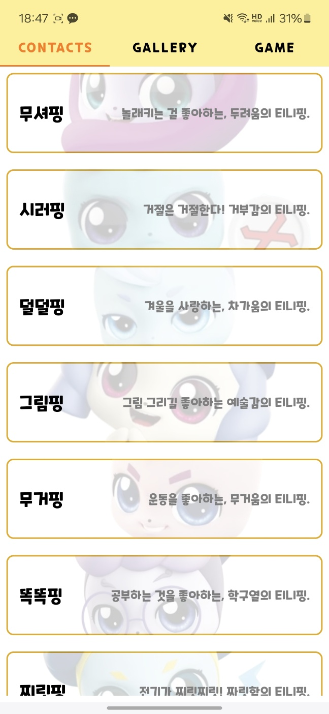

### 티니핑거
### Team

---

- 이승민
    - 카이스트 전산학부 21학번
- 장효진
    - 성균관대학교 소프트웨어학과 23학번

### Tech Stack

---

**Front-end** : Kotlin

**IDE** : Android Studio

## Details

---

### 스플래시 화면

- 앱을 처음 실행하면 앱의 제목이 포함된 스플래시 화면이 표시됩니다.

### 메인 화면

- 메인 화면에서는 `TabLayout` 및 `ViewPager`를 활용하여 각 `Fragment`간의 전환을 터치 제스처 및 상단 네비게이션 바로 구현했습니다.

### Tab1: 티니핑 연락처 화면

티니핑들의 정보를 제공하는 탭

 

티니핑 리스트

티니핑 상세정보 확인하기

- 각 티니핑 항목마다 해당하는 티니핑의 이미지를 배경으로 하여, 이름 및 설명을 표시합니다.
- 정보 데이터는 `JSON` 파일에서 로드되며, 이를 `ListView`를 통해 사용자에게 보여줍니다.
- 항목 터치 시 상세정보를 팝업창을 이용해 확인할 수 있으며, 티니핑의 대표 대사와 함께 해당 티니핑을 간략하게 소개하는 유튜브 미리보기를 **`pierfrancescosoffritti.androidyoutubeplayer`** 라이브러리를 이용하여 삽입하였습니다.

### Tab2: 티니핑 도감 화면

지금까지 수집한 티니핑들을 확인할 수 있는 탭

수집 모드

Show all 토글을 클릭한 화면

- 게임 탭에서 로미를 터치하여 수집한 티니핑들은 해당 도감 탭에 박제됩니다.
- 카드 목록은 `RecyclerView` 를 사용하여 각 카드를 `CardView` 로 표시합니다.
- 카드 배경은 등급에 따라 각기 다른 레이어를 그라디언트 색상을 추가하여 적용했습니다.
- 우측 상단의 토글 단추를 누르면 데이터베이스의 속성을 변경하여 수집 여부와 관계없이 앱에 존재하는 모든 티니핑이 표시되도록 하였습니다.

### Tab3: 티니핑 게임 화면

초기 화면

터치 시 이펙트

수집 메시지

가호 메시지

- 게임 탭에서 점수와 함께 터치 시마다 랜덤한 위치로 움직이는 로미를 확인할 수 있으며, 로미를 터치할 때마다 점수가 증가하고 일정 확률로 티니핑을 수집합니다.
- 점수와 티니핑 수집 현황은 앱을 종료하고 재실행할 시 복원됩니다.
- 로미를 터치할 떄마다 하트 이펙트가 발동하며, 로미의 크기가 살짝 작아졌다가 다시 원래 크기로 돌아오게 함으로써 터치하는 듯한 느낌을 가미하였습니다.
- 티니핑을 처음 수집할 시 등급에 맞는 그라디언트 색상 배경과 함께 해당 티니핑을 수집했다는 팝업 메시지가 나타납니다.
- 이미 수집한 티니핑에 대해서는, 터치 때마다 일정 확률로 각 티니핑의 가호가 발현됩니다.
- 각 티니핑의 가호는 다음과 같습니다:
    - **노멀**
        - 무셔핑, 덜덜핑: 이후 터치 100회 동안 로미가 덜덜 떱니다
        - 시러핑: 노멀 티니핑 중 하나를 미수집으로 전환합니다
        - 그림핑: 이후 터치 100회 동안 로미가 랜덤한 티니핑으로 변합니다
        - 무거핑, 똑똑핑: 이후 터치 100회 동안 로미 이동속도가 감소합니다
        - 떠벌핑, 찌릿핑: 이후 터치 100회 동안 로미 이동속도가 증가합니다
        - 다조핑: 노멀 티니핑 중 하나를 수집으로 전환합니다
    - **에픽**
        - 베베핑: 이후 터치 100회 동안 터치 추가점수 +1을 적용합니다
        - 코자핑: 이후 100초 동안 로미가 잠에 들어 터치가 반영되지 않습니다
        - 모야핑: 에픽 티니핑 중 하나를 수집으로 전환합니다
        - 차캐핑: 이후 터치 100회 동안 터치 추가점수 +1을 적용합니다
        - 아휴핑: 이후 터치 100회 동안 50%의 확률로 터치가 반영되지 않습니다
    - **레어**
        - 바네핑: 이후 터치 100회 동안 커치 추가점수 +4를 적용합니다
        - 공쥬핑: 이후 터치 100회 동안 로미 크기가 증가합니다
        - 앙대핑: 이후 터치 100회 동안 로미 크기가 감소합니다
    - **슈퍼레어**
        - 하츄핑: 하츄핑을 얻으셨군요! 당신이 승자입니다 ^^
        - 악동핑: 수집 시 이후 터치마다 0.05% 확률로 점수가 초기화됩니다

### 티니핑거 apk
https://drive.google.com/file/d/12pAKZjNeiL7DIzLceBS-_l6n8W3mp-Ua/view
